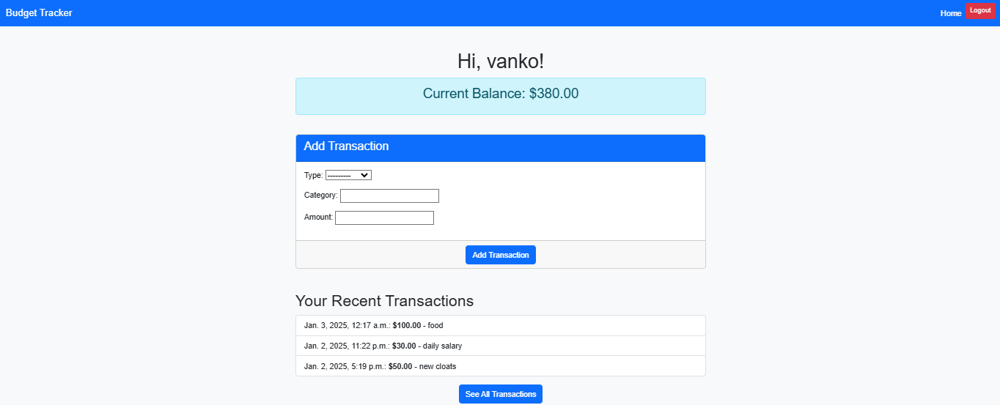

# Budget Tracker

**Budget Tracker** is a web application built with Django that allows users to track and manage their personal budget by adding and tracking transactions, viewing their current balance, and reviewing the history of their expenses. [Visit my website!!](https://financeapp-gpsd.onrender.com/)

The project uses **Django** for the backend and **Bootstrap** for styling to provide an easy-to-use interface that is responsive across different devices.

## Features

- **User Registration & Login** - Each user has their own account and can register and log in to the app.
- **Add Transactions** - Users can add expenses that are automatically reflected in their budget.
- **Balance Tracking** - Displays the user's current balance in real-time, calculated from the recorded transactions.
- **Transaction History** - Users can view a list of their recent transactions and filter them for specific periods.
- **Navigation Bar** - A user-friendly interface with easy navigation between pages.

## Technologies

- **Django** - Web framework for building the application.
- **PostgreSQL** - Lightweight database used for storing data.
- **Bootstrap** - CSS framework for styling the user interface.
- **HTML/CSS** - For basic page structure and styling.

## Using the App

### Registration and Login:
- Click "Register" or "Login" in the navigation bar to create an account or log in.

### Add Transactions:
- After logging in, you can add new transactions by entering the date, category, and amount.

### Track Balance:
- After adding transactions, your current balance will be displayed on the homepage, and it will update automatically.

### View Transactions:
- You can see all your transactions or view only the recent ones using the provided buttons.

## Screenshots

### Homepage

### Registration Page

### Transaction History

